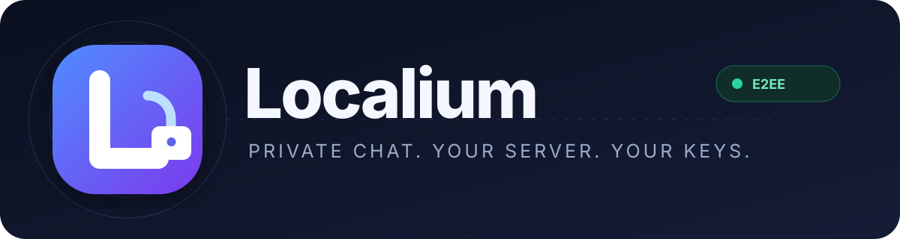
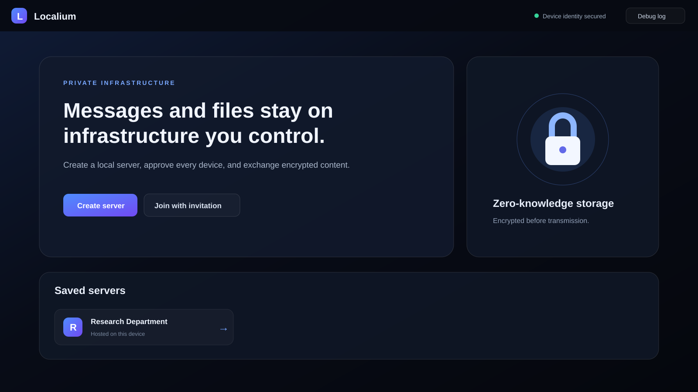
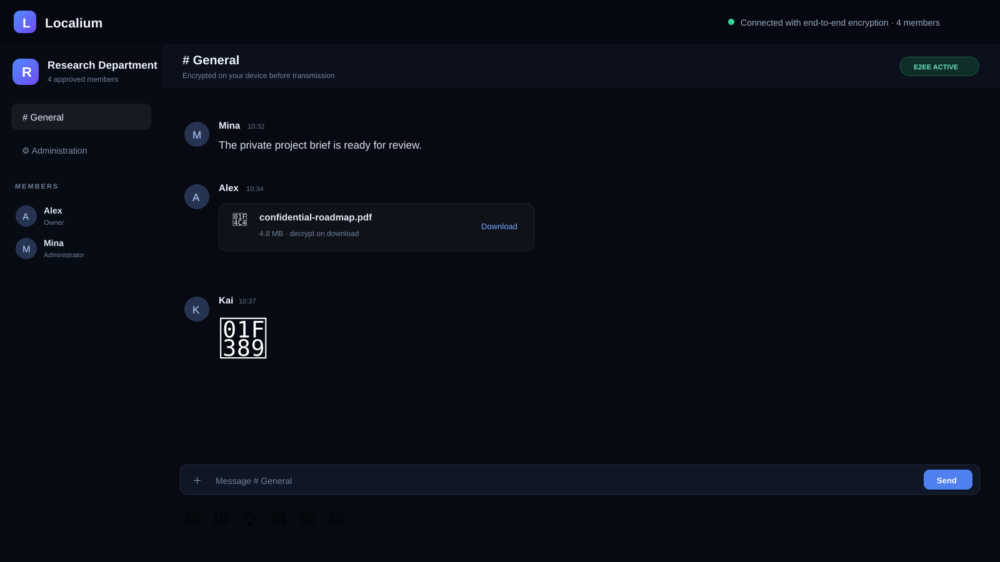

<p align="center">
  
</p>

<div align="center">
  <a href="https://github.com/YanagiKH/Localium/actions/workflows/ci.yml"></a>
  <a href="https://github.com/YanagiKH/Localium/actions/workflows/codeql.yml"></a>
  <a href="https://github.com/YanagiKH/Localium/releases"></a>
  
  
  [English](README.md) · [繁體中文](README_ZH.md) · [日本語](README_JP.md)
</div>

**Localium** 是提供給學校、公司、實驗室與組織使用的自架桌面聊天室，適合在自行控制的基礎設施上交換私密訊息與文件。桌面程式可直接建立本機伺服器，也可透過邀請碼加入其他 Localium 伺服器。每一台新裝置都必須由伺服器擁有者或具權限的管理員明確批准。

> [!IMPORTANT]
> 沒有任何軟體能保證絕對安全。Localium 採用以安全為核心的架構與現代密碼學，但實際安全性仍取決於端點安全、作業系統更新、防火牆設定、可信任的管理員與正確的備份流程。正式部署前請閱讀[安全手冊](docs/SECURITY_MANUAL.md)。

## 介面

<p align="center"></p>
<p align="center"></p>

## 功能

| 範圍 | 已包含的行為 |
| --- | --- |
| 伺服器所有權 | 可直接從桌面程式建立並執行私人 HTTPS/WSS 伺服器。伺服器狀態與加密資產保存在主機的 Localium 資料目錄。 |
| 邀請碼 | 預設邀請碼 15 分鐘後到期。支援永久邀請碼、使用次數限制與立即撤銷。 |
| 審批機制 | 有效邀請碼只能建立待審核請求。擁有者或具 `approve_members` 權限的成員必須批准裝置，並把聊天室金鑰加密給該裝置。 |
| 端對端加密 | XChaCha20-Poly1305 保護訊息與檔案；X25519 sealed box 傳送聊天室金鑰；Ed25519 簽章驗證裝置。 |
| 傳輸保護 | 每台伺服器會產生本機 TLS 憑證。邀請碼包含 SHA-256 指紋，桌面端只會在指紋相符時接受憑證。 |
| 私密檔案 | 支援任何檔案類型，單檔上限 25 MiB。檔案會在本機加密、以不透明密文上傳、下載後於本機解密並透過原生視窗儲存。 |
| 貼圖 | 內建六種貼圖。具權限的成員可新增或刪除加密圖片貼圖。 |
| 管理功能 | 管理待審核裝置、邀請碼、成員、伺服器外觀、加密背景、貼圖、稽核事件與自訂角色。 |
| 自訂權限 | 角色可組合 `manage_server`、`manage_invites`、`approve_members`、`manage_members`、`manage_roles`、`manage_stickers`、`send_messages`、`send_files`、`view_audit`。 |
| 本機金鑰保護 | 裝置私鑰與已保存的聊天室金鑰透過 Electron `safeStorage` 加密，並由作業系統憑證保護機制管理。 |
| 除錯 | 可選用 JSON Lines 伺服器日誌、程式內日誌檢視器、固定驗證指令與完整[除錯手冊](docs/DEBUGGING.md)。 |

## 0.2.0 新增功能

- 全面調整桌面與 Android 響應式介面。
- 成員可上傳端對端加密頭像；具權限成員可管理加密背景與圖片貼圖。
- 伺服器主可在 `mods/` 目錄配置安全的資料型 JSON 模組，並依角色權限提供斜線指令。
- Android 10 以上可加入伺服器並使用完整客戶端及管理功能，但不能建立或主控伺服器。

詳見 [Android 客戶端](docs/ANDROID.md) 與 [伺服器模組](docs/MODS.md)。

## 安全架構

```text
已批准裝置
  ├─ Ed25519 簽章金鑰 ── 簽署伺服器挑戰
  ├─ X25519 金鑰對 ───── 解開加密的聊天室金鑰
  └─ 聊天室金鑰 ──────── 使用 XChaCha20-Poly1305 加密訊息與檔案
               │
               ▼ 已釘選 TLS（WSS/HTTPS）
Localium 伺服器
  ├─ 驗證簽章、角色、邀請碼、審批、限制與工作階段
  ├─ 保存加密訊息封包與加密資產檔案
  └─ 無法從保存的 sealed-key 紀錄推導聊天室金鑰
```

重要安全屬性：

- 邀請碼攜帶 SHA-256 憑證指紋，用於伺服器身分釘選。
- 裝置以每次連線獨立的挑戰簽章進行驗證。
- 工作階段權杖為隨機 256 位元值，只保存在記憶體中，12 小時後失效。
- 邀請密碼只以 SHA-256 雜湊保存，不保存可重用明文。
- WebSocket 壓縮預設關閉，降低壓縮側通道風險。
- 限制訊息大小、檔案大小與每分鐘 Socket 操作次數。
- Renderer 無 Node.js 權限；Electron 啟用 `contextIsolation`、停用 `nodeIntegration`、套用嚴格 CSP、拒絕權限請求，並只開放最小 preload bridge。

請閱讀[安全手冊](docs/SECURITY_MANUAL.md)、[架構文件](docs/ARCHITECTURE.md)與 [SECURITY.md](SECURITY.md)了解威脅模型、限制、部署檢查與漏洞回報流程。

## 安裝

### 方法一：Release 安裝檔

從 [GitHub Releases](https://github.com/YanagiKH/Localium/releases) 下載對應作業系統版本：

- Windows：NSIS 安裝程式或 portable 執行檔
- macOS：DMG 或 ZIP
- Linux：AppImage 或 `tar.gz`

除非 Release 工作流程配置了組織簽章憑證，否則產生的檔案不會自動具備平台程式碼簽章。內部分發前請確認來源與雜湊值。

### 方法二：從原始碼執行

需求：Node.js 22.12 以上、npm 10 以上，以及受支援的桌面作業系統。

```bash
git clone https://github.com/YanagiKH/Localium.git
cd Localium
npm install
npm run dev
```

### 方法三：建立本機 unpacked 程式

```bash
npm install
npm run package
```

輸出會放在 `release/`，適合內部測試或受管理的軟體部署。

### 方法四：建立平台安裝檔

```bash
npm install
npm run dist
```

安裝檔必須在目標作業系統上產生。GitHub Release 工作流程會在原生 Windows、macOS 與 Linux runner 上建立檔案。

詳細內容請參考[安裝與部署](docs/INSTALLATION.md)。

## 建立第一台伺服器

1. 開啟 Localium 並選擇 **Create server**。
2. 輸入伺服器名稱、顯示名稱與監聽連接埠，預設為 `9473`。
3. 開啟 **Administration**，建立 15 分鐘或永久邀請碼。
4. 透過可信任管道傳送邀請碼。
5. 加入裝置會送出已簽章的待審核請求。
6. 檢查裝置名稱並選擇批准或拒絕。
7. 批准時，管理員端會把聊天室金鑰以 X25519 公鑰加密給加入裝置。
8. 已批准裝置重新連線、在本機解密聊天室金鑰後，才能存取加密內容。

## 網路設定

Localium 監聽 `0.0.0.0`，並使用第一個非 loopback IPv4 位址建立邀請碼。若用戶端必須使用 VPN 主機名稱或固定的私有 DNS 名稱，請在啟動前設定 `LOCALIUM_ADVERTISED_HOST`。在學校或公司區域網路中：

- 只開放指定 Localium 連接埠的 TCP 入站流量。
- 防火牆規則只允許可信任子網路。
- 不要把連接埠直接暴露到公開網際網路。
- 遠端使用時，採用組織自行控制的 VPN 或私有 overlay network。
- 成員需要連線時，主機必須保持開機。
- 即使仍需管理員批准，邀請碼也應視為秘密。

## 資料位置

| 平台 | 預設程式資料根目錄 |
| --- | --- |
| Windows | `%APPDATA%\Localium` |
| macOS | `~/Library/Application Support/Localium` |
| Linux | `~/.config/Localium` |

每台自架伺服器包含 `servers/<server-id>/server-state.json`、`assets/`、`tls/` 與可選的 `logs/`。用戶端 vault 保存在 `client-vault.bin`，並透過作業系統安全儲存機制加密。在 Linux 上，若 Electron 使用不安全的 `basic_text` 後端，Localium 會拒絕啟動；系統必須提供 GNOME Keyring、KWallet 或其他受支援的 secret service。

## Debug 模式

啟用完整伺服器資訊日誌：

```bash
LOCALIUM_DEBUG=1 npm run dev
```

PowerShell：

```powershell
$env:LOCALIUM_DEBUG = "1"
npm run dev
```

可在程式內按下 **Debug log** 檢視目前伺服器日誌。日誌不會記錄邀請密碼、聊天室金鑰、私鑰、工作階段權杖、明文訊息或明文檔名。詳情請參考[除錯手冊](docs/DEBUGGING.md)。

## 驗證

```bash
npm run lint
npm run typecheck
npm test
npm run build
npm run package
npm audit --omit=dev --audit-level=high
```

GitHub Actions 會執行儲存庫 lint、TypeScript 檢查、密碼學與伺服器整合測試、renderer/main 建置、正式依賴稽核、跨平台 unpacked 打包與 CodeQL 分析。

## 目前限制

- Localium `0.1.0` 目前每台伺服器使用一組共享聊天室金鑰。移除成員會阻止後續伺服器存取，但不會消除該成員已持有的密文或金鑰。尚未實作自動版本化金鑰輪替與具前向保密性的 sender chain。
- 已批准端點若遭入侵，攻擊者可讀取該端點原本能存取的內容。
- 伺服器仍可觀察裝置識別碼、時間戳、密文大小、成員、角色與網路位址等營運中繼資料。
- 內建伺服器以小型與中型私人群組為目標，尚未針對大型公開社群進行負載測試。
- 尚未包含高可用叢集與外部資料庫複寫。
- Release 程式碼簽章需要管理員自行提供平台憑證。

## 文件

- [安裝與部署](docs/INSTALLATION.md)
- [安全手冊](docs/SECURITY_MANUAL.md)
- [除錯手冊](docs/DEBUGGING.md)
- [架構文件](docs/ARCHITECTURE.md)
- [貢獻指南](CONTRIBUTING.md)
- [漏洞回報](SECURITY.md)

## 授權

Localium 採用 [MIT License](LICENSE)。
